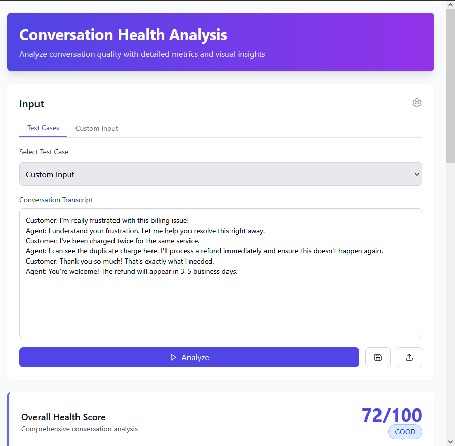
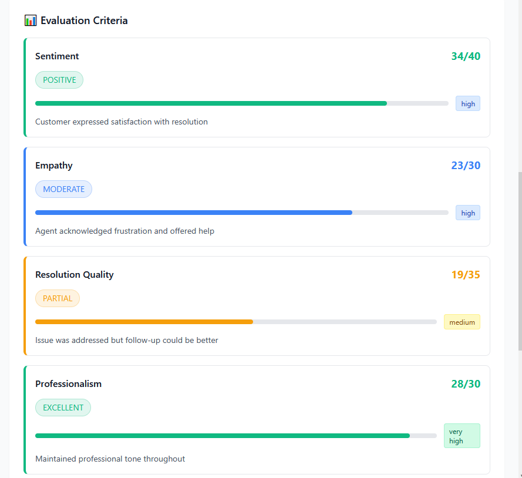
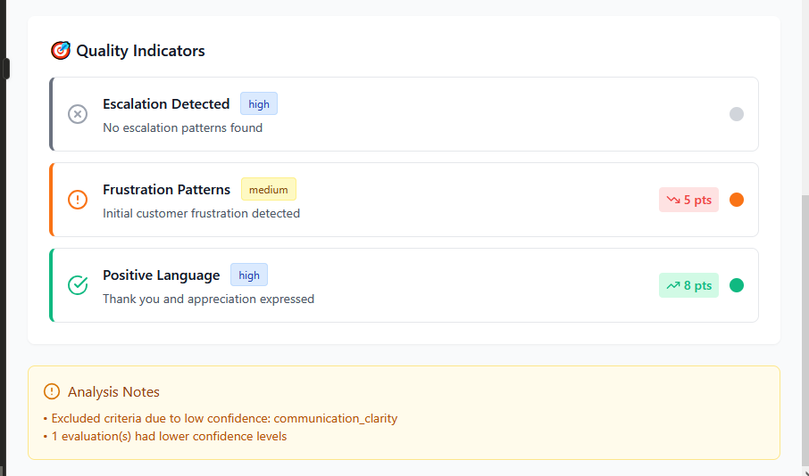
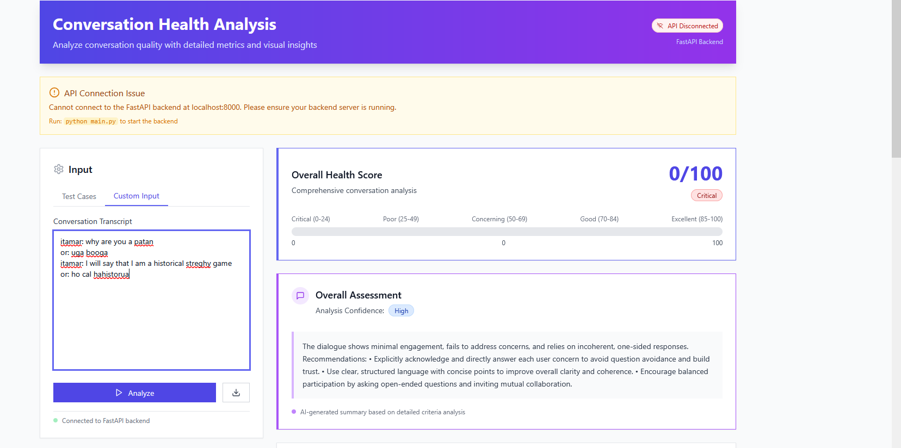
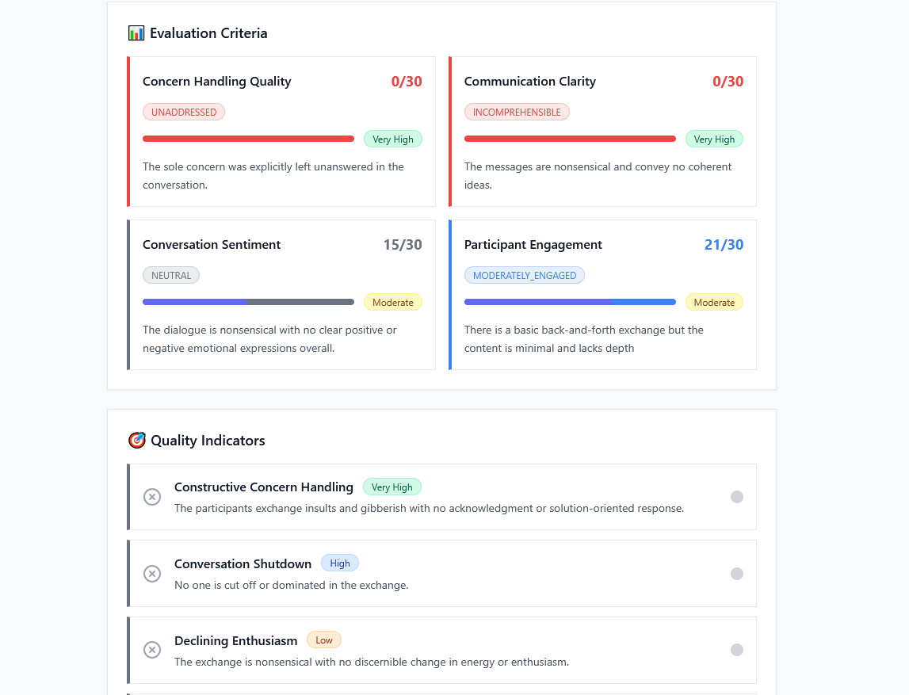
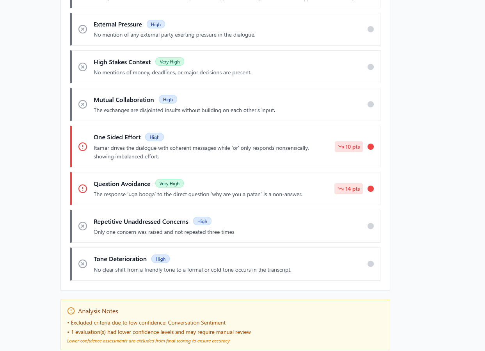
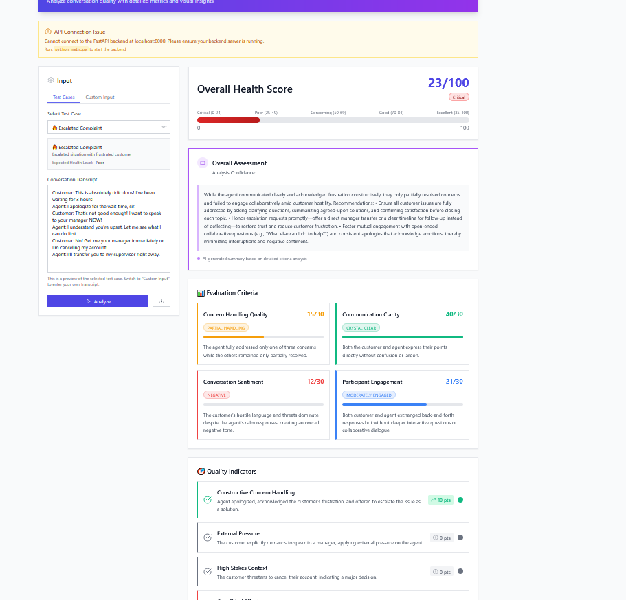

# Communication Health Intelligence System

**Complete Product Specification & Engineering Architecture**

---

## 1. OVERVIEW

We want a system that can tell us the health of a conversation. The goal is to measure conversation health, explain why it is that way, and provide concrete advice on what to do next.

**Core Value Proposition:** Convert customer conversation transcripts into actionable, quantifiable insights about relationship health, issue resolution quality, and communication effectiveness.

**Key Questions Answered:**

- **How healthy is this conversation?** (A scored assessment with clear severity levels)
- **Why is it this way?** (Metrics and flags highlighting key drivers)
- **What should we do?** (Concrete recommendations and next steps)

---

# Part 1: PRODUCT SPECIFICATION

## 2. PRODUCT VISION: Customer Intelligence Dashboard

### What Teams Get:

- **Health Gauges:** Real-time visual indicators showing conversation health (Red, Yellow, Green status) with scores out of 100
- **Why Analysis:** Clear explanations of contributing patterns and flagged issues
- **Action Items:** Specific, actionable recommendations to improve or maintain relationships

### Focus for Now:

- Deliver answers to **How healthy?** and **Why?**
- Integrate **concrete advice** generation at the end of the pipeline to guide users

---

## 3. COMMUNICATION HEALTH METRICS

Metrics quantify conversation health, helping teams understand issues and take action. Each metric returns **ordinal enum-based responses** (like "Poor/Good/Excellent") rather than raw numbers to improve reliability when using LLMs - this approach is more accurate for AI analysis and enables flexible score weighting for different customer needs. Every metric evaluation includes an **AI-generated explanation** of why that specific rating was assigned.

| Metric                          | What It Measures                                 | Output Options                                                                            | Max Points | User Value                                        |
| ------------------------------- | ------------------------------------------------ | ----------------------------------------------------------------------------------------- | ---------- | ------------------------------------------------- |
| **1. Sentiment Classification** | Overall emotional tone of the conversation       | Positive / Neutral / Negative                                                             | 30         | Early detection of relationship decline or uplift |
| **2. Participant Engagement**   | Level of active participation and responsiveness | Highly Engaged / Moderately Engaged / Poorly Engaged                                      | 30         | Reveals imbalance or lack of engagement           |
| **3. Concern Handling Quality** | How well concerns/questions were addressed       | Comprehensive / Substantial / Partial / Surface-Level / Unaddressed                       | 30         | Highlights churn risk if concerns ignored         |
| **4. Communication Clarity**    | Clarity and effectiveness of communication       | Crystal Clear / Mostly Clear / Somewhat Unclear / Frequently Confusing / Incomprehensible | 40         | Prevents miscommunication and failures            |

### Detailed Metric Descriptions

**Sentiment Classification:**
Analyzes overall tone—positive is upbeat and encouraging, neutral is balanced, negative signals frustration or hostility. Helps teams catch early signs of relationship stress or opportunity.

**Participant Engagement:**
Measures how actively all parties participate. Poor engagement often signals dissatisfaction or imbalance, which can harm the relationship.

**Concern Handling Quality:**
Evaluates completeness and relevance of responses to customer issues. Surface-level or unaddressed concerns indicate risk of churn.

**Communication Clarity:**
Rates how clearly ideas are conveyed. Unclear communication risks misunderstandings and damaged trust.

---

## 4. RELATIONSHIP INTELLIGENCE FLAGS

Flags are specific detected patterns with assigned severity and impact on health scores. Each flag detection includes an **AI-generated explanation** of the specific evidence found and reasoning for the detection.

### Critical (Red) Flags — Require Immediate Attention

- **Repetitive Unaddressed Concerns** (Score impact: -30): Same issue raised 3+ times without resolution. Signals systemic failure.
- **Escalation Language** (-12): Use of words like "unacceptable", "disappointed", or demands to escalate.
- **Tone Deterioration** (-15): Shift from friendly/casual to formal/cold tone mid-conversation.
- **Conversation Shutdown** (-15): Dismissive or non-engaging behaviors blocking dialogue.

### Warning (Yellow) Flags — Monitor Closely

- **One-Sided Effort** (-10): Conversation effort is heavily imbalanced.
- **Question Avoidance** (-14): Direct questions receive non-answers or topic changes.
- **Declining Enthusiasm** (-8): Noticeable drop in energy or engagement over time.

### Positive (Green) Flags — Healthy Patterns

- **Mutual Collaboration** (+8): Both parties contribute thoughtfully.
- **Constructive Concern Handling** (+10): Concerns addressed with solutions and empathy.

### Informational (Blue) Flags — Context Awareness

- **High Stakes:** Money, deadlines, or major decisions are involved.
- **External Pressure:** External factors (boss/client) influencing dynamics.

---

## 5. OVERALL COMMUNICATION HEALTH SCORE (0-100)

### Score Ranges & Meaning

| Score Range | Label     | Description                                   |
| ----------- | --------- | --------------------------------------------- |
| 85-100      | Excellent | Strong positive indicators; low risk          |
| 70-84       | Good      | Stable conversation; minor issues             |
| 50-69       | At Risk   | Noticeable concerns; recommend intervention   |
| 25-49       | Poor      | Significant problems; immediate action needed |
| 0-24        | Critical  | Severe issues; urgent attention required      |

### Example Output Snippet

```json
{
  "overall_score": 67,
  "health_level": "At Risk",
  "score_breakdown": {
    "sentiment_health": 25,
    "communication_quality": 22,
    "attention_health": 20
  },
  "flag_penalties": -10,
  "issues": ["Repeated billing concerns", "Unclear next steps"],
  "recommended_actions": [
    "Acknowledge the repeated concern about billing",
    "Clarify next steps using simpler language",
    "Ask if the customer has any remaining questions"
  ]
}
```

---

### Future TBD Features

- Conversation trend analysis over time
- Predictive escalation alerts
- Personalized recommendation generation
- Multi-conversation and team-level health tracking
- Industry-specific tuning and models
- Real-time alerts and notifications

---

# Part 2: ENGINEERING ARCHITECTURE

## 6. ARCHITECTURAL PHILOSOPHY & DECISIONS

### Core Design Principles

**1. Configuration-Driven Architecture**
Rather than hardcoding metrics and flags, the entire system is driven by a JSON configuration file. This enables:

- Rapid iteration on metrics and scoring without code changes
- Customer-specific calibration (different industries, teams, use cases)
- Easy A/B testing of different evaluation approaches
- Non-technical stakeholders can modify scoring logic

**2. Modular Subgraph Architecture**
The system uses a graph constructor that combines modular subgraphs:

- **Clean separation of concerns:** Each subgraph handles one aspect (sentiment, flags, scoring)
- **Parallel execution:** Multiple metrics can be evaluated simultaneously
- **Easy extensibility:** New evaluation types can be added as new subgraphs
- **Testability:** Each subgraph can be tested independently
- **Reusability:** Subgraphs can be mixed and matched for different workflows

**3. Confidence-Aware Processing**
Every LLM evaluation includes a confidence assessment, enabling:

- **Reliability filtering:** Low-confidence results are excluded from final scores
- **Transparency:** Users see what was excluded and why
- **Quality control:** Prevents unreliable LLM outputs from affecting decisions
- **Gradual degradation:** System still functions with partial confidence rather than failing completely

**4. Dynamic Model Generation**
Pydantic models are generated dynamically from configuration:

- **Type safety:** Ensures runtime validation of LLM outputs
- **Automatic adaptation:** New metrics automatically get proper validation
- **Development efficiency:** No need to manually create models for each new metric

---

## 7. KEY COMPONENTS

| Module                         | Purpose                                          |
| ------------------------------ | ------------------------------------------------ |
| **models.py**                  | Pydantic schemas for all data structures         |
| **config_manager.py**          | Loads and validates JSON configuration           |
| **llm.py**                     | Abstracted LLM interface with structured outputs |
| **pydantic_model_creators.py** | Dynamically generates models from config         |
| **node_builders.py**           | Creates LangGraph nodes for metrics/flags        |
| **subgraph_creators.py**       | Constructs specialized analysis subgraphs        |
| **graph_builder.py**           | Assembles complete workflows from subgraphs      |
| **score_calculator.py**        | Applies scoring logic with confidence filtering  |
| **prompts.py**                 | Structured prompts for each analysis task        |

### LangGraph Workflow Structure

```
Entry: conversation transcript
    ↓
[Parallel Execution]
├── Sentiment Analysis
├── Engagement Evaluation
├── Clarity Assessment
├── Flag Detection (all types)
└── Concern Analysis
    ↓
Score Synthesis (with confidence filtering)
    ↓
Recommendation Generation
```

---

## 8. CONFIGURATION SYSTEM DESIGN

### 8.1 Benefits of JSON-Driven Configuration

**Business Benefits:**

- Non-developers can tune the system
- Rapid experimentation with new metrics
- Customer-specific calibration
- Easy rollback of configuration changes
- can add stuff way way quicker
- less code

**Engineering Benefits:**

- Declarative system behavior
- Testable configuration changes
- Reduced code complexity

### 8.2 Configuration Structure

```json
{
  "evaluation_criteria": {
    "sentiment": {
      "description": "Overall emotional tone",
      "prompt": "Analyze sentiment...",
      "response_options": {
        "positive": { "score_multiplier": 1.0, "description": "Upbeat tone" },
        "negative": { "score_multiplier": -0.4, "description": "Hostile tone" }
      },
      "max_points": 30,
      "minimum_confidence": "high"
    }
  },
  "quality_indicators": [
    {
      "name": "escalation_language",
      "type": "critical",
      "score_impact": -12,
      "description": "Use of escalation language",
      "minimum_confidence": "very_high"
    }
  ],
  "health_score_ranges": {
    "excellent": { "min_score": 85, "max_score": 100, "color": "#10b981" }
  }
}
```

---

## 9. RELIABILITY & CONFIDENCE SYSTEM

### 9.1 Confidence-Based Filtering

Each LLM evaluation includes confidence levels:

- **very_high:** Clear evidence, no ambiguity
- **high:** Strong evidence with minor uncertainty
- **moderate:** Some evidence, some ambiguity
- **low:** Weak evidence, significant uncertainty
- **very_low:** Minimal evidence, high uncertainty

### 9.2 Filtering Logic

**For Metrics:** If confidence is below threshold, use default/neutral scoring
**For Flags:** Only apply flag penalties if confidence meets minimum requirement
**For Users:** Show excluded items and reasoning in uncertainty report

### 9.3 Benefits

- **Reduces false positives:** Prevents unreliable detections from affecting scores
- **Maintains system credibility:** Users trust results more when uncertainty is acknowledged
- **Graceful degradation:** System provides partial results rather than failing

---

## 10. CUSTOM vs CONFIGURABLE FLOWS

### 10.1 Hybrid Architecture Design

The system supports both:

**Configurable Flows:** Standard metrics and flags defined in JSON

- Automatically generate analysis nodes
- Parallel execution for efficiency
- Easy to modify and extend

**Custom Flows:** Complex logic requiring specialized implementation

- Custom flows can be implemented as their own subgraphs
- Domain-specific analysis patterns
- Multi-step reasoning processes

### 10.2 Subgraph Types

**ConcernAnalysisSubgraphCreator:** Custom logic for:

1. Identifying concerns/questions in conversation
2. Assessing how well each concern was addressed
3. Overall concern handling quality evaluation

**ConfigBasedEvaluationSubgraphCreator:** Automatically generates nodes for:

- All configurable metrics (sentiment, engagement, clarity)
- All configurable flags (critical, warning, positive, info)

**ScoringSynthesisSubgraphCreator:** Combines results into:

- Confidence-filtered scoring
- Health level determination
- Final assessment synthesis

---

## 11. FUTURE ENGINEERING CONSIDERATIONS

### 11.1 Scalability Challenges

**Long Conversations:** Current system processes entire transcript in single prompts

- **Solution:** Implement conversation chunking with context preservation
- **Implementation:** Sliding window approach with overlap between chunks

**Multi-Party Analysis:** Current system assumes general participant analysis

- **Solution:** Individual participant analysis with role-specific metrics
- **Implementation:** Parse speaker attribution and analyze communication patterns per participant

### 11.2 Planned Enhancements

**Conversation History Integration:**

- Track health trends over multiple conversations
- Detect relationship trajectory (improving vs. declining)
- Historical context for current conversation analysis

**Predictive Analytics:**

- Early warning systems for escalation likelihood
- Relationship risk scoring based on patterns
- Proactive intervention recommendations

**Real-Time Processing:**

- Live conversation analysis during ongoing calls/chats
- Dynamic coaching suggestions for customer service reps
- Escalation alerts before situations deteriorate

**Industry-Specific Tuning:**

- Healthcare communication patterns
- Financial services compliance considerations
- Technical support effectiveness metrics

---

## 12. 🚀 QUICK START GUIDE

### Run Backend + UI

**1. Start FastAPI Backend**

```bash
python app.py
# Server runs on http://localhost:8000
```

**2. Start React Frontend**

```bash
cd conversation-health-ui
npm run dev
# UI runs on http://localhost:5173
```

**3. Test**

- Open http://localhost:5173
- Select test case → Click "Analyze" → See results
- Download JSON with analysis data

That's it! 🎉

**Note:** The app.py and frontend are not considered part of my core deliverable and are provided for demonstration purposes only. The code quality for these components is not optimized as I was instructed to focus on the core analysis engine rather than UI implementation.

---

# mocks I made





# Implemented ui




# UI AFTER BUG FIXES DONE AT SUNDAY MORNING

